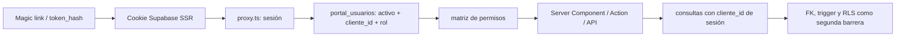
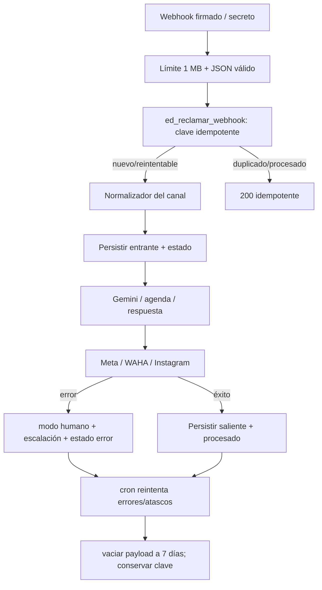

# Mapa de arquitectura real tras el hardening

## Límites

`respondo-portal` es el SaaS para pymes clientes. Comparte Supabase con el motor
2.0, pero no es `web-respondo` ni Respondo HQ. Es un monolito modular Next.js
16/React 19 desplegable en Vercel; integra Supabase, Gemini, Meta/Instagram,
WAHA, Google Calendar y un puente best-effort a HQ.

| Capa | Ubicación | Responsabilidad |
|---|---|---|
| UI pública | `app/login`, `app/reservar/[slug]`, `app/estado` | acceso, reserva y diagnóstico mínimo |
| UI portal | `app/(portal)` | inbox, CRM, embudo, analítica, agenda, conocimiento e integraciones |
| Sesión | `proxy.ts`, `lib/supabaseAuth.ts` | refresco de cookie y guarda optimista |
| Autorización | `lib/auth.ts`, `lib/permisos.ts` | usuario activo → tenant/rol/capacidad |
| Dominio | `lib/agenda*`, `conversaciones`, `responderBot`, `inbound*` | reglas de negocio y canales |
| Persistencia | `lib/db.ts`, `sql/*.sql` | Supabase server-only con `service_role`, esquema/RPC/triggers/RLS |
| Resiliencia | `lib/webhookInbox.ts`, `lib/seguridad.ts` | idempotencia/reintentos y rate limit global con respaldo local |
| Observabilidad | `lib/observabilidad.ts`, `lib/auditoria.ts`, `lib/latidos.ts` | correlation ID, logs redacted, auditoría y salud |

## Autenticación, autorización y tenant

`service_role` omite RLS; por eso nunca llega al navegador y toda operación
privada deriva el tenant desde la sesión. La matriz actual es:

| Capacidad | dueño | staff |
|---|---:|---:|
| conversaciones, clientes, embudo, agenda operativa | sí | sí |
| configuración de agenda, conocimiento, insights, integraciones | sí | no |

## Mensajería durable

El handler todavía ejecuta síncronamente, pero la tabla inbox evita confirmar
un fallo como éxito y permite recuperación. Los IDs y logs no guardan cuerpos,
tokens, correos ni teléfonos.

## Datos y rendimiento

- Identidad: `portal_usuarios`, `ed_clientes`, `ed_empleados`.
- Conversación: `ed_contactos`, `ed_mensajes`, `ed_chat_estado`,
  `ed_escalaciones`, `ed_resultados`, `ed_webhook_eventos`.
- Agenda: `ed_servicios`, `ed_profesionales`, `ed_servicio_profesional`,
  `ed_citas`, `ed_bloqueos`, `ed_clases`.
- Operación: `ed_rate_limits`, `ed_auditoria_portal`, `ed_latidos`,
  `ed_seguimientos`, `ed_insights`.

Clientes y conversaciones paginan en base. La bandeja usa RPC de la migración
273 y conserva un fallback temporal de 100 filas para despliegues donde el
código llegue antes que SQL. Mensajes iniciales/polling toman los últimos
500/200; el embudo filtra el intervalo en PostgreSQL antes de relaciones.

## Fronteras públicas

- Reservas: públicas por slug, con límite global y validación server-side del
  slot ofrecido.
- iCal: bearer URL, rate limit, caché privada y token rotatable.
- Webhooks: HMAC Meta/Instagram o secreto WAHA, inbox durable y 5xx reintentable.
- Cron: secreto obligatorio; seguimientos, informes, tokens IG, reintentos y
  latido.
- Salud: detalle solo con secreto; respuesta pública mínima y rate-limited.

## Seguridad del navegador

`next.config.mjs` elimina `X-Powered-By` y aplica CSP, HSTS, nosniff,
X-Frame-Options, Referrer-Policy, COOP y Permissions-Policy. El proxy de medios
solo presenta inline MIME seguros; el resto fuerza descarga binaria.
